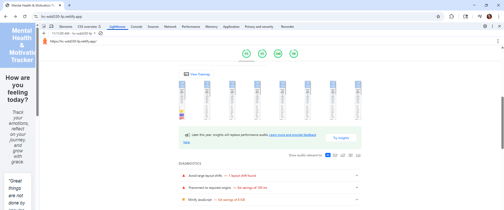
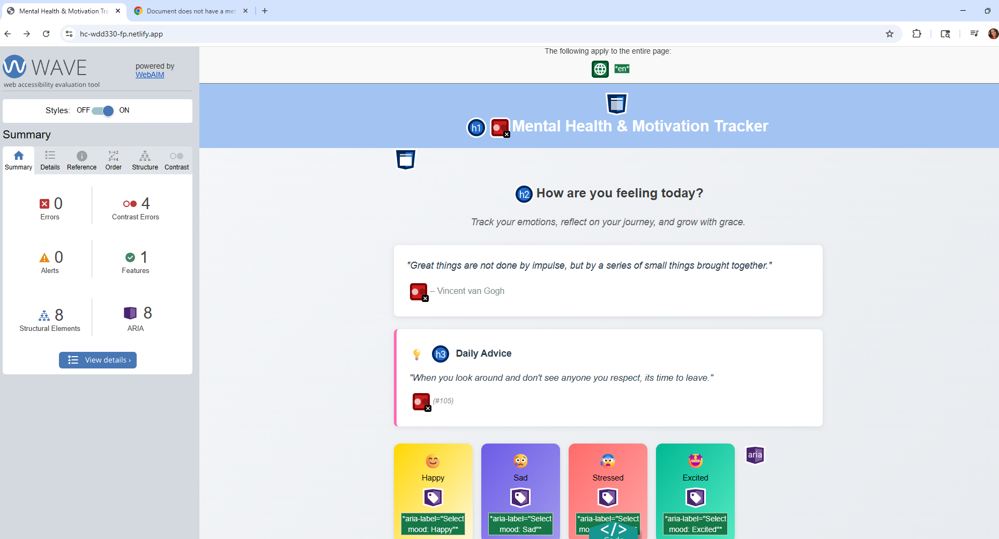
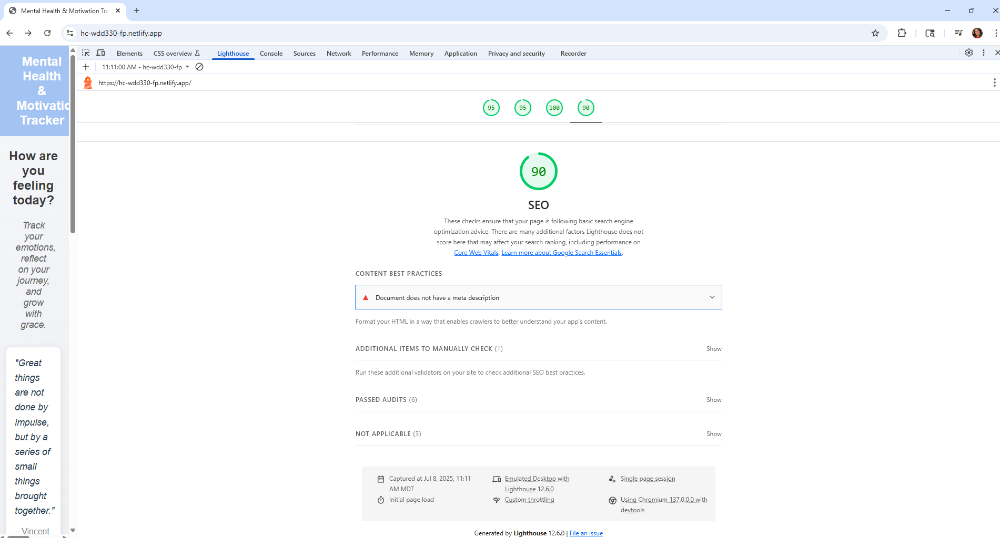

# Accessibility Review – Mental Health and Motivation Tracker

**URL tested:** https://hc-wdd330-fp.netlify.app/

---

##  Issue 1: Cumulative Layout Shift (CLS) score slightly high

- **Tool:** Lighthouse
- **Details:** The report flagged a layout shift with a score of 0.126 (ideal is < 0.1). This indicates that some elements (specifically div.mood-buttons) may be loading late and causing parts of the UI to shift position after the page starts rendering.
- **Why it matters:** Unexpected movement on the screen can confuse users, cause mis-clicks, and especially affect users with motor impairments or those relying on screen magnifiers. It’s also a negative UX signal for mobile users with slower connections.
- **Screenshot:** 

---

##  Issue 2: Add Preconnect to required origins

- **Tool:** Lighthouse 
- **Details:** Consider adding preconnect or dns-prefetch reshouce hints to important third-party origins. 
- **Why it matters:** Helps to establish the early connections. 
- **Screenshot:** 

---

##  Issue 3: Failed Contrast Ratio

- **Tool:** Lighthouse & Wave
- **Details:** Multiple blocks of text (including quotes under the motivational heading and Daily Advice section) fail WCAG 2.1 AA contrast guidelines. The light gray text on a white or light background is not readable enough. 
- **Why it matters:** Users with visual impairments, including older adults and those with color blindness, may not be able to read important content if it lacks sufficient contrast.   
- **Screenshot:**  

---

##  Issue 4: No meta description

- **Tool:** Lighthouse  
- **Details:** Document does not have a meta description. 
- **Why it matters:** A high-quality, unique meta description makes your page appear more relevant and can increase your search traffic.   
- **Screenshot:** 

---

## Issue 5: Unclear or redundant ARIA labels on mood buttons

- **Tool:** WAVE
- **Details:** Mood buttons include `aria-label="Select mood: Happy"` etc., but the visible button already says “Happy,” “Sad,” etc. This may be redundant or confusing for screen readers.
- **Why it matters:** Screen readers may announce the same content twice, creating a noisy or unclear experience for users relying on assistive tech.
- **Screenshot:** 